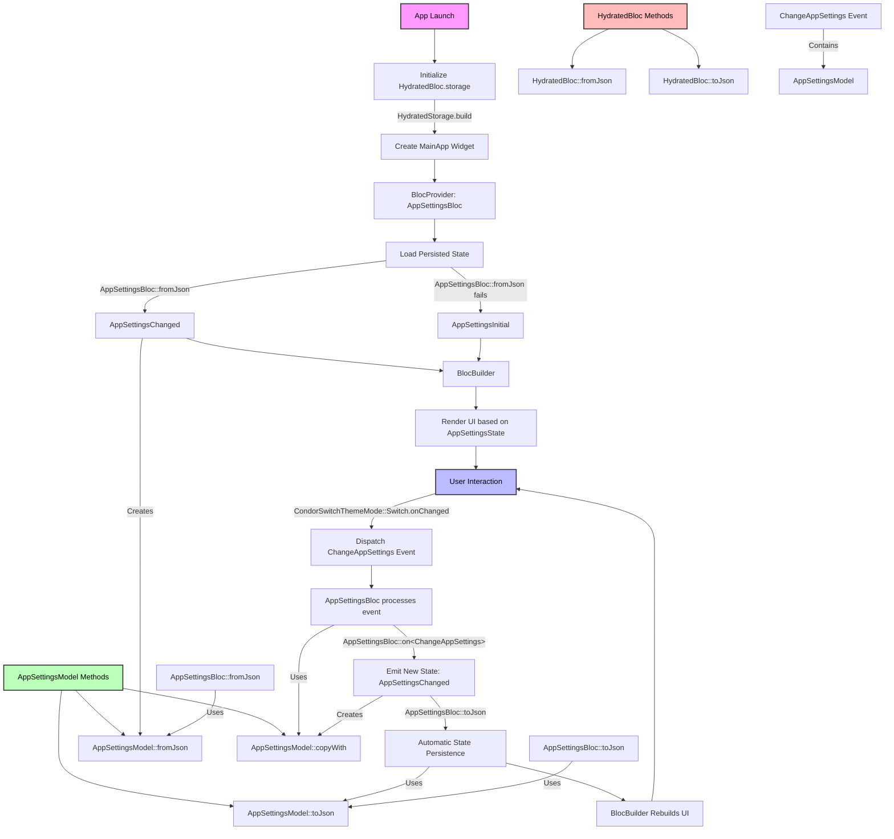

# Hydrated BLoC: A Guide to App Persistance

# TABLE OF CONTENTS

# WHAT IS THIS GUIDE ABOUT

This guide is made for me Andrea Condorelli, aka ilCONDORA, and maybe for others. This guide tackles the lack of proper documentation for the best package of all the [pub.dev](https://pub.dev/) database. In short Hydrated BLoC([hydrated_bloc](https://pub.dev/packages/hydrated_bloc)), is a fusion between the No-SQL database [Hive](https://pub.dev/packages/hive) and the [BLoC](https://pub.dev/packages/flutter_bloc) package. This system helps integrate persistence between instances.

# DEPENDENCIES

To use Hydrated BLoC in a **FLUTTER** project the only things to add are the packages hydrated_bloc, path_provider and flutter_bloc. These are the only ones to add because hive and others are already included in hydrated_bloc. Maybe the only one that needs an explanation is path_provider so I will explain it a little. So path_provider is needed only because it retrieves the location of the Roaming folder(WIndows) where then hydrated_bloc passes it to hive to then create a secure database to store and retrieve data.

# MODIFY main.dart

So the first step is to modify the **main.dart** file. So that it transforms from this:

```dart
void main() {
  runApp(const MainApp());
}
```

To this:

```dart
Future<void> main() async {
  WidgetsFlutterBinding.ensureInitialized();

  /// Initialize Hydrated Bloc Storage dynamically.
  HydratedBloc.storage = await HydratedStorage.build(
    storageDirectory: kIsWeb
        ? HydratedStorage
            .webStorageDirectory // Web storage.
        : await getApplicationSupportDirectory(), // Store data in the \AppData\Roaming\ilCONDORA folder in Windows and /.local/share in Linux, idk for MacOS.
  );

  runApp(const MainApp());
}
```

Let's do things step by step:

1. Transform from void to Future<void>.
2. `WidgetsFlutterBinding.ensureInitialized();` is used to ensure that everything inside of the function is executed first.
3. The initialization of the Hydrated Bloc Storage is done dynamically thanks to the `kIsWeb` boolean variable, this variable is **true** when the app is running on a **browser**.
4. It is of the **MOST ABSOLUTE IMPORTANCE TO USE** `await getApplicationSupportDirectory()` because this function finds the folder \AppData\Roaming on Windows and /.local/share on Linux, idk for MacOS.

# SIMPLE DATA MANAGEMENT

Now here things are going to get complicated but not as much as the complex one. What I intend for simple data management is using BLoC to modify the Theme Mode of the app.

## Creation of the model and its methods

```dart
// -/lib/models/app_settings_model.dart

/// Model for the application settings.
class AppSettingsModel {
  final ThemeMode themeMode;

  /// Sets the default value for the application theme.
  static const ThemeMode defaultThemeMode = ThemeMode.light;

  /// Constructor for creating an AppSettings instance.
  AppSettingsModel({this.themeMode = defaultThemeMode});

  /// Create an AppSettings instance from a JSON map.
  factory AppSettingsModel.fromJson(Map<String, dynamic> json) {
    return AppSettingsModel(
      themeMode:
          ThemeMode.values[json['themeMode'] as int? ?? defaultThemeMode.index],
    );
  }

  /// Converts an AppSettings instance to a JSON map.
  Map<String, dynamic> toJson() {
    return {
      'themeMode': themeMode.index,
    };
  }

  /// Creates a copy of the current AppSettingsModel with the option to modify specific properties. If a property is not provided, the current value is retained.
  /// This method is used to create a new instance of AppSettingsModel with modified properties.
  AppSettingsModel copyWith({ThemeMode? themeMode}) {
    return AppSettingsModel(
      themeMode: themeMode ?? this.themeMode,
    );
  }
}
```

The code above shows the entire class that represents the data that will be registered in the database. In this case we set a default value that is linked to the class constructor, so if we call the constructor without parameters, it defaults to the registered Theme Mode, this will be useful when I create the initial state of the BLoC later on.

The **fromJson** and **toJson** methods are needed to serialize and deserialize the data, these methods will be called from the *app_settings_bloc.dart* file and be used to save the data in the device storage.

The **copyWith** method is used when we want to update the data by modifying only what we want, in this case there is only one option. We'll see how this is used in the BLoC implementation later.

## BLoC files

 📂 bloc
├── 📂 app_settings_bloc
│      ├── 📄 app_settings_bloc.dart
│      ├── 📄 app_settings_event.dart
│      └── 📄 app_settings_state.dart
└── 📂 devices_bloc
         ├── 📄 devices_bloc.dart
         ├── 📄 devices_event.dart
         └── 📄 devices_state.dart

### app_settings_state.dart

```dart
part of 'app_settings_bloc.dart';

/// Base state for managing the application's settings.
/// It holds an instance of `AppSettingsModel`, which contains the current settings.
@immutable
sealed class AppSettingsState {
  final AppSettingsModel appSettingsModel;

  /// Constructor that initializes the state with the provided [appSettingsModel].
  const AppSettingsState(this.appSettingsModel);
}

/// Represents the initial state of the application settings.
/// This state is used when the app is first launched or when the settings are not yet loaded.
class AppSettingsInitial extends AppSettingsState {
  /// Creates an initial state with default settings using the `AppSettingsModel` default constructor.
  AppSettingsInitial() : super(AppSettingsModel());
}

/// Represents a state where the application settings have changed.
/// This state is emitted when the user updates any of the settings.
class AppSettingsChanged extends AppSettingsState {
  /// Constructor that accepts a new [appSettingsModel] to represent the updated settings.
  const AppSettingsChanged(super.appSettingsModel);
}
```

I've already explained how everything works inside the code, the only thing to say is that in the `AppSettingsInitial` the constructor doesn't accept anything because we have a default theme that we put in `AppSettingsModel`.

### app_settings_event.dart

```dart
part of 'app_settings_bloc.dart';

/// Base event for managing the application's settings.
/// Events are actions that trigger changes in the application's settings.
@immutable
sealed class AppSettingsEvent {}

/// Event triggered to change the application settings.
/// This event is dispatched when the user modifies the settings.
class ChangeAppSettings extends AppSettingsEvent {
  final AppSettingsModel appSettingsModel;

  /// Constructor that initializes the event with the updated [appSettingsModel].
  /// The new settings provided will replace the current ones in the state.
  ChangeAppSettings({required this.appSettingsModel});
}
```

### app_settings_bloc.dart

```dart
import 'package:flutter/material.dart';
import 'package:hydrated_bloc/hydrated_bloc.dart';
import 'package:wireless_debugging_devices_manager/models/app_settings_model.dart';

part 'app_settings_event.dart';
part 'app_settings_state.dart';

/// Manages the state of the application settings using the BLoC pattern.
/// Utilizes HydratedBloc to automatically persist and restore the state.
class AppSettingsBloc extends HydratedBloc<AppSettingsEvent, AppSettingsState> {
  /// Initializes the bloc with the initial state of the app settings.
  AppSettingsBloc() : super(AppSettingsInitial()) {
    // Handles the ChangeAppSettings event and emits a new state with the updated settings model.
    on<ChangeAppSettings>((event, emit) {
      emit(AppSettingsChanged(event.appSettingsModel));
    });
  }

  /// Converts a JSON object into an instance of [AppSettingsState].
  ///
  /// Called by `HydratedBloc` when reopening the app to restore the saved state
  /// from a persisted instance. If the JSON is valid, it returns the state
  /// [AppSettingsChanged] with the new settings. If the conversion
  /// fails (e.g., due to corrupted or invalid data), it returns the initial state
  /// [AppSettingsInitial], which means there is no valid data
  /// to restore.
  @override
  AppSettingsState? fromJson(Map<String, dynamic> json) {
    try {
      final appSettingsModel = AppSettingsModel.fromJson(json);
      return AppSettingsChanged(appSettingsModel);
    } catch (_) {
      return AppSettingsInitial();
    }
  }

  /// Converts the current [AppSettingsState] into a JSON object for persistence.
  ///
  /// This function is called by `HydratedBloc` to save the current state
  /// when there are changes. If the state is [AppSettingsChanged], it serializes
  /// the settings model into JSON and saves it. If the state is the initial state
  /// [AppSettingsInitial], it returns `null`, which indicates that there is no state
  /// to persist (e.g., the default state of the app).
  @override
  Map<String, dynamic>? toJson(AppSettingsState state) {
    if (state is AppSettingsChanged) {
      return state.appSettingsModel.toJson();
    }
    return null;
  }
}
```

## Usage of BLoC

Now let’s see where and how to use BLoC in our app.

```dart
class MainApp extends StatelessWidget {
  const MainApp({super.key});

  @override
  Widget build(BuildContext context) {
    return BlocProvider(
      /// Provides the AppSettingsBloc to the widget tree.
      create: (context) => AppSettingsBloc(),
      child: BlocBuilder<AppSettingsBloc, AppSettingsState>(
        /// Rebuilds this widget only when the theme mode changes in the settings.
        buildWhen: (previous, current) =>
            previous.appSettingsModel.themeMode !=
            current.appSettingsModel.themeMode,
        builder: (context, state) {
          return MaterialApp(
            title: 'Wireless Debugging Devices Manager',
            debugShowCheckedModeBanner: false,
            theme: CondorAppTheme.lightTheme,
            darkTheme: CondorAppTheme.darkTheme,
            /// The theme is determined by the current settings in the app's state.
            themeMode: state.appSettingsModel.themeMode,
            home: Builder(builder: (context) {
              /// Initialize the service that manages the SnackBar.
              condorSnackBar.init(context);
              return const HomeScreen();
            }),
          );
        },
      ),
    );
  }
}
```

In the **main.dart** file we need to wrap `MaterialApp` with `BlocBuilder` and `BlocProvider` , the **create** prompt of `BlocProvider` needs a BLoC so that it can access the state and events, the child is `BlocBuider` and we must specify the types and those are `AppSettingsBloc` and `AppSettingsState` . In this way to access and use the data we just use ***state.|name of the model|.|name fo the data|***. In my case it’s this `themeMode: state.appSettingsModel.themeMode` . 

To change the theme mode I use a custom widget, here it is:

```dart
// -/lib/widgets/condor_switch_theme_mode.dart

import 'package:flutter/material.dart';
import 'package:flutter_bloc/flutter_bloc.dart';
import 'package:wireless_debugging_devices_manager/bloc/app_settings_bloc/app_settings_bloc.dart';

/// CondorSwitchThemeMode is a stateless widget that allows users to toggle between light and dark modes.
/// It listens to the AppSettingsBloc to check the current theme mode and updates the UI accordingly.
class CondorSwitchThemeMode extends StatelessWidget {
  const CondorSwitchThemeMode({
    super.key,
  });

  @override
  Widget build(BuildContext context) {
    return BlocBuilder<AppSettingsBloc, AppSettingsState>(
      /// Rebuilds this widget only when the user changes the theme mode.
      buildWhen: (previous, current) =>
          previous.appSettingsModel.themeMode !=
          current.appSettingsModel.themeMode,
      builder: (context, state) {
        /// Determines if the current theme mode is dark.
        final isDarkMode = state.appSettingsModel.themeMode == ThemeMode.dark;
        return Row(
          mainAxisSize: MainAxisSize.min,
          children: [
            Icon(
              size: 30,
              isDarkMode ? Icons.dark_mode : Icons.light_mode,
              color: isDarkMode ? Colors.grey.shade300 : Colors.orange.shade400,
            ),
            const SizedBox(width: 8),
            Text(
              isDarkMode ? 'Dark Mode Enabled' : 'Light Mode Enabled',
              style: TextStyle(
                color: isDarkMode ? Colors.white : Colors.black,
              ),
            ),
            const SizedBox(width: 8),

            /// Switch widget that allows the user to toggle between light and dark modes.
            Switch(
              value: isDarkMode,
              onChanged: (bool value) {
                /// Updates the app settings by dispatching the ChangeAppSettings event to the BLoC.
                context.read<AppSettingsBloc>().add(
                      ChangeAppSettings(
                        appSettingsModel: state.appSettingsModel.copyWith(
                          themeMode: value ? ThemeMode.dark : ThemeMode.light,
                        ),
                      ),
                    );
              },
            )
          ],
        );
      },
    );
  }
}

```

So the first widget to use is `BlocBuilder` and just like before we specify the BLoC were he can listens to the state and trigger events. In the `Switch` widget when it’s clicked it searches in the context to access `AppSettingsBloc` and through the `add()` method it adds an event to the context, this triggers a rebuild of this Widget and also in the main.dart because there `BlocBuilder` was used as well. The event triggered is `ChangeAppSettings` and it acceps a new model with the new data and we do that by using the current instance of the state and accessing the method `copyWith()` of the model class so that we can overwrite the data with a new instance of the model, after passing the new data BLoC knows that the event was triggered and utilizes it’s `toJson` method to persist the data in the Hive database. 

## Flowchart



# COMPLEX DATA MANAGEMENT

Now here things are going to get complicated but not as much as the complex one. What I intend for simple data management is using BLoC to modify the Theme Mode of the app.

## Creation of the model and its methods

```dart
// -/lib/models/app_settings_model.dart

/// Model for the application settings.
class AppSettingsModel {
  final ThemeMode themeMode;

  /// Sets the default value for the application theme.
  static const ThemeMode defaultThemeMode = ThemeMode.light;

  /// Constructor for creating an AppSettings instance.
  AppSettingsModel({this.themeMode = defaultThemeMode});

  /// Create an AppSettings instance from a JSON map.
  factory AppSettingsModel.fromJson(Map<String, dynamic> json) {
    return AppSettingsModel(
      themeMode:
          ThemeMode.values[json['themeMode'] as int? ?? defaultThemeMode.index],
    );
  }

  /// Converts an AppSettings instance to a JSON map.
  Map<String, dynamic> toJson() {
    return {
      'themeMode': themeMode.index,
    };
  }

  /// Creates a copy of the current AppSettingsModel with the option to modify specific properties. If a property is not provided, the current value is retained.
  /// This method is used to create a new instance of AppSettingsModel with modified properties.
  AppSettingsModel copyWith({ThemeMode? themeMode}) {
    return AppSettingsModel(
      themeMode: themeMode ?? this.themeMode,
    );
  }
}
```

The code above shows the entire class that represents the data that will be registered in the database. In this case we set a default value that is linked to the class constructor, so if we call the constructor without parameters, it defaults to the registered Theme Mode, this will be useful when I create the initial state of the BLoC later on.

The **fromJson** and **toJson** methods are needed to serialize and deserialize the data, these methods will be called from the *app_settings_bloc.dart* file and be used to save the data in the device storage.

The **copyWith** method is used when we want to update the data by modifying only what we want, in this case there is only one option. We'll see how this is used in the BLoC implementation later.

## BLoC files

 📂 bloc
├── 📂 app_settings_bloc
│      ├── 📄 app_settings_bloc.dart
│      ├── 📄 app_settings_event.dart
│      └── 📄 app_settings_state.dart
└── 📂 devices_bloc
         ├── 📄 devices_bloc.dart
         ├── 📄 devices_event.dart
         └── 📄 devices_state.dart

### app_settings_state.dart

```dart
part of 'app_settings_bloc.dart';

/// Base state for managing the application's settings.
/// It holds an instance of `AppSettingsModel`, which contains the current settings.
@immutable
sealed class AppSettingsState {
  final AppSettingsModel appSettingsModel;

  /// Constructor that initializes the state with the provided [appSettingsModel].
  const AppSettingsState(this.appSettingsModel);
}

/// Represents the initial state of the application settings.
/// This state is used when the app is first launched or when the settings are not yet loaded.
class AppSettingsInitial extends AppSettingsState {
  /// Creates an initial state with default settings using the `AppSettingsModel` default constructor.
  AppSettingsInitial() : super(AppSettingsModel());
}

/// Represents a state where the application settings have changed.
/// This state is emitted when the user updates any of the settings.
class AppSettingsChanged extends AppSettingsState {
  /// Constructor that accepts a new [appSettingsModel] to represent the updated settings.
  const AppSettingsChanged(super.appSettingsModel);
}
```

I've already explained how everything works inside the code, the only thing to say is that in the `AppSettingsInitial` the constructor doesn't accept anything because we have a default theme that we put in `AppSettingsModel`.

### app_settings_event.dart

```dart
part of 'app_settings_bloc.dart';

/// Base event for managing the application's settings.
/// Events are actions that trigger changes in the application's settings.
@immutable
sealed class AppSettingsEvent {}

/// Event triggered to change the application settings.
/// This event is dispatched when the user modifies the settings.
class ChangeAppSettings extends AppSettingsEvent {
  final AppSettingsModel appSettingsModel;

  /// Constructor that initializes the event with the updated [appSettingsModel].
  /// The new settings provided will replace the current ones in the state.
  ChangeAppSettings({required this.appSettingsModel});
}
```

### app_settings_bloc.dart

```dart
import 'package:flutter/material.dart';
import 'package:hydrated_bloc/hydrated_bloc.dart';
import 'package:wireless_debugging_devices_manager/models/app_settings_model.dart';

part 'app_settings_event.dart';
part 'app_settings_state.dart';

/// Manages the state of the application settings using the BLoC pattern.
/// Utilizes HydratedBloc to automatically persist and restore the state.
class AppSettingsBloc extends HydratedBloc<AppSettingsEvent, AppSettingsState> {
  /// Initializes the bloc with the initial state of the app settings.
  AppSettingsBloc() : super(AppSettingsInitial()) {
    // Handles the ChangeAppSettings event and emits a new state with the updated settings model.
    on<ChangeAppSettings>((event, emit) {
      emit(AppSettingsChanged(event.appSettingsModel));
    });
  }

  /// Converts a JSON object into an instance of [AppSettingsState].
  ///
  /// Called by `HydratedBloc` when reopening the app to restore the saved state
  /// from a persisted instance. If the JSON is valid, it returns the state
  /// [AppSettingsChanged] with the new settings. If the conversion
  /// fails (e.g., due to corrupted or invalid data), it returns the initial state
  /// [AppSettingsInitial], which means there is no valid data
  /// to restore.
  @override
  AppSettingsState? fromJson(Map<String, dynamic> json) {
    try {
      final appSettingsModel = AppSettingsModel.fromJson(json);
      return AppSettingsChanged(appSettingsModel);
    } catch (_) {
      return AppSettingsInitial();
    }
  }

  /// Converts the current [AppSettingsState] into a JSON object for persistence.
  ///
  /// This function is called by `HydratedBloc` to save the current state
  /// when there are changes. If the state is [AppSettingsChanged], it serializes
  /// the settings model into JSON and saves it. If the state is the initial state
  /// [AppSettingsInitial], it returns `null`, which indicates that there is no state
  /// to persist (e.g., the default state of the app).
  @override
  Map<String, dynamic>? toJson(AppSettingsState state) {
    if (state is AppSettingsChanged) {
      return state.appSettingsModel.toJson();
    }
    return null;
  }
}
```

## Usage of BLoC

Now let’s see where and how to use BLoC in our app.

```dart
class MainApp extends StatelessWidget {
  const MainApp({super.key});

  @override
  Widget build(BuildContext context) {
    return BlocProvider(
      /// Provides the AppSettingsBloc to the widget tree.
      create: (context) => AppSettingsBloc(),
      child: BlocBuilder<AppSettingsBloc, AppSettingsState>(
        /// Rebuilds this widget only when the theme mode changes in the settings.
        buildWhen: (previous, current) =>
            previous.appSettingsModel.themeMode !=
            current.appSettingsModel.themeMode,
        builder: (context, state) {
          return MaterialApp(
            title: 'Wireless Debugging Devices Manager',
            debugShowCheckedModeBanner: false,
            theme: CondorAppTheme.lightTheme,
            darkTheme: CondorAppTheme.darkTheme,
            /// The theme is determined by the current settings in the app's state.
            themeMode: state.appSettingsModel.themeMode,
            home: Builder(builder: (context) {
              /// Initialize the service that manages the SnackBar.
              condorSnackBar.init(context);
              return const HomeScreen();
            }),
          );
        },
      ),
    );
  }
}
```

In the **main.dart** file we need to wrap `MaterialApp` with `BlocBuilder` and `BlocProvider` , the **create** prompt of `BlocProvider` needs a BLoC so that it can access the state and events, the child is `BlocBuider` and we must specify the types and those are `AppSettingsBloc` and `AppSettingsState` . In this way to access and use the data we just use ***state.|name of the model|.|name fo the data|***. In my case it’s this `themeMode: state.appSettingsModel.themeMode` . 

To change the theme mode I use a custom widget, here it is:

```dart
// -/lib/widgets/condor_switch_theme_mode.dart

import 'package:flutter/material.dart';
import 'package:flutter_bloc/flutter_bloc.dart';
import 'package:wireless_debugging_devices_manager/bloc/app_settings_bloc/app_settings_bloc.dart';

/// CondorSwitchThemeMode is a stateless widget that allows users to toggle between light and dark modes.
/// It listens to the AppSettingsBloc to check the current theme mode and updates the UI accordingly.
class CondorSwitchThemeMode extends StatelessWidget {
  const CondorSwitchThemeMode({
    super.key,
  });

  @override
  Widget build(BuildContext context) {
    return BlocBuilder<AppSettingsBloc, AppSettingsState>(
      /// Rebuilds this widget only when the user changes the theme mode.
      buildWhen: (previous, current) =>
          previous.appSettingsModel.themeMode !=
          current.appSettingsModel.themeMode,
      builder: (context, state) {
        /// Determines if the current theme mode is dark.
        final isDarkMode = state.appSettingsModel.themeMode == ThemeMode.dark;
        return Row(
          mainAxisSize: MainAxisSize.min,
          children: [
            Icon(
              size: 30,
              isDarkMode ? Icons.dark_mode : Icons.light_mode,
              color: isDarkMode ? Colors.grey.shade300 : Colors.orange.shade400,
            ),
            const SizedBox(width: 8),
            Text(
              isDarkMode ? 'Dark Mode Enabled' : 'Light Mode Enabled',
              style: TextStyle(
                color: isDarkMode ? Colors.white : Colors.black,
              ),
            ),
            const SizedBox(width: 8),

            /// Switch widget that allows the user to toggle between light and dark modes.
            Switch(
              value: isDarkMode,
              onChanged: (bool value) {
                /// Updates the app settings by dispatching the ChangeAppSettings event to the BLoC.
                context.read<AppSettingsBloc>().add(
                      ChangeAppSettings(
                        appSettingsModel: state.appSettingsModel.copyWith(
                          themeMode: value ? ThemeMode.dark : ThemeMode.light,
                        ),
                      ),
                    );
              },
            )
          ],
        );
      },
    );
  }
}

```

So the first widget to use is `BlocBuilder` and just like before we specify the BLoC were he can listens to the state and trigger events. In the `Switch` widget when it’s clicked it searches in the context to access `AppSettingsBloc` and through the `add()` method it adds an event to the context, this triggers a rebuild of this Widget and also in the main.dart because there `BlocBuilder` was used as well. The event triggered is `ChangeAppSettings` and it acceps a new model with the new data and we do that by using the current instance of the state and accessing the method `copyWith()` of the model class so that we can overwrite the data with a new instance of the model, after passing the new data BLoC knows that the event was triggered and utilizes it’s `toJson` method to persist the data in the Hive database. 

## Flowchart

